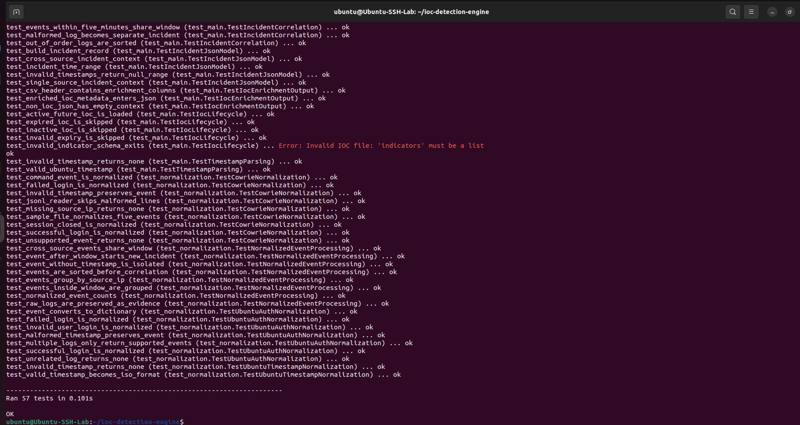
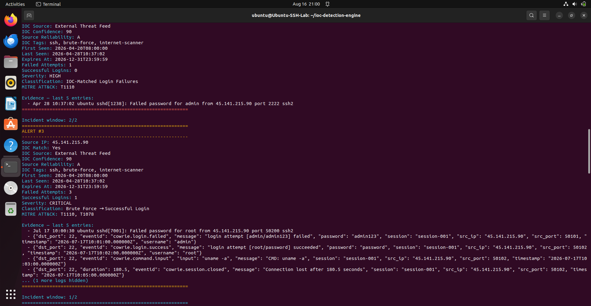
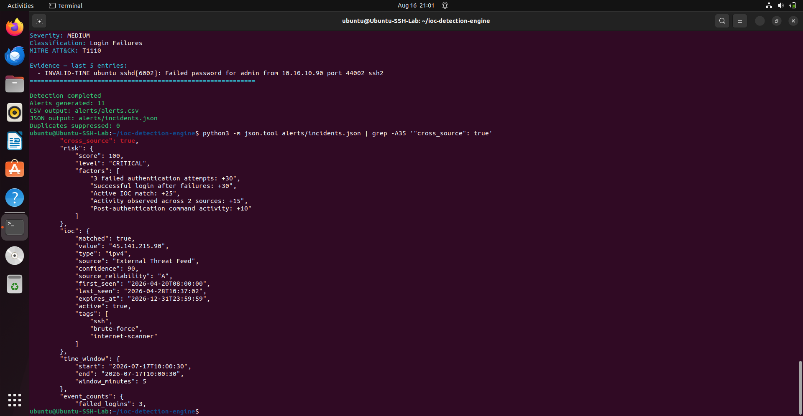
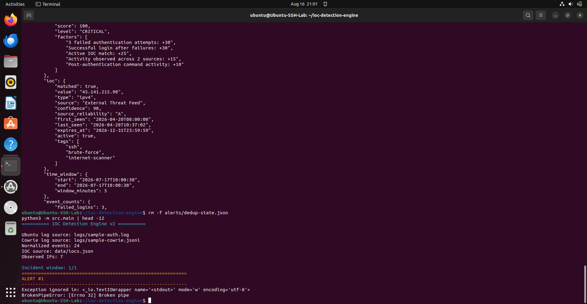

# Threat Informed Detection Engine

A Python-based, multi-source security detection engine that analyses Ubuntu SSH authentication logs and Cowrie honeypot events, correlates attacker behaviour, enriches incidents with threat intelligence, and generates explainable security alerts.

The project was developed in an isolated Linux lab to demonstrate practical detection engineering, threat intelligence enrichment, event normalisation, incident correlation, MITRE ATT&CK mapping, risk scoring, testing, and analyst-focused reporting.

---

## Project Overview

Security telemetry often arrives in different formats and from different tools. A Linux authentication log and a honeypot JSON event may describe related attacker activity, but they cannot be analysed consistently until they are normalised.

The Threat informed Detection Engine converts Ubuntu SSH and Cowrie events into a shared security-event model and then:

1. ingests events from multiple telemetry sources
2. normalises them into a common schema
3. groups activity by source IP address
4. correlates related events within five-minute incident windows
5. detects suspicious authentication behaviour
6. matches source IPs against lifecycle-aware Threat informed intelligence
7. calculates an explainable incident risk score
8. maps activity to MITRE ATT&CK
9. suppresses repeated incidents using persistent deduplication
10. generates terminal, CSV, and JSON outputs

The result is a structured incident containing evidence, source context, severity, risk factors, Threat informed intelligence, ATT&CK techniques, and event counts.

---

## Key Capabilities

- Multi-source event ingestion
- Ubuntu SSH authentication log parsing
- Cowrie honeypot JSONL event parsing
- Shared security-event normalisation
- Source IP grouping
- Five-minute incident correlation
- Cross-source incident correlation
- Out-of-order timestamp handling
- Malformed-event isolation
- SSH brute-force detection
- Repeated authentication-failure detection
- Successful login after repeated failures
- Known malicious Threat informed detection
- Lifecycle-aware Threat informed enrichment
- Explainable numeric risk scoring
- Severity and classification assignment
- MITRE ATT&CK mapping
- Persistent incident deduplication
- Terminal, CSV, and JSON outputs
- Evidence preservation
- Automated unit testing

---

## Architecture

```text
 Ubuntu Authentication Logs          Cowrie Honeypot JSONL
             |                                  |
             v                                  v
   Ubuntu Log Normalisation           Cowrie Event Normalisation
             |                                  |
             +----------------+-----------------+
                              |
                              v
                  Shared SecurityEvent Model
                              |
                              v
                    Group Events by Source IP
                              |
                              v
                  Five-Minute Correlation Windows
                              |
                +-------------+-------------+
                |                           |
                v                           v
       Behavioural Detection          Threat informed Intelligence Match
                |                           |
                +-------------+-------------+
                              |
                              v
                 Explainable Risk Scoring
                              |
                              v
                Classification and ATT&CK Mapping
                              |
                              v
                  Persistent Deduplication
                              |
                +-------------+-------------+
                |             |             |
                v             v             v
             Terminal        CSV           JSON
```

---

## Normalised Security Event Model

Different log formats are converted into a shared event structure:

```python
SecurityEvent(
    timestamp,
    source_ip,
    event_type,
    username,
    source,
    destination_port,
    protocol,
    raw_log,
)
```

Normalised event types include:

- `authentication_failure`
- `authentication_success`
- `command_executed`
- `session_closed`

This allows correlation and detection logic to operate independently of the original log format.

---

## Supported Data Sources

### Ubuntu SSH Authentication Logs

The engine parses:

- failed password attempts
- invalid-user authentication attempts
- successful SSH logins

Example:

```text
Jul 17 10:00:30 ubuntu sshd[7001]: Failed password for root from 45.141.215.90 port 50200 ssh2
```

### Cowrie Honeypot Events

The engine processes:

- `cowrie.login.failed`
- `cowrie.login.success`
- `cowrie.command.input`
- `cowrie.session.closed`

Example:

```json
{
  "eventid": "cowrie.command.input",
  "src_ip": "45.141.215.90",
  "input": "uname -a",
  "timestamp": "2026-07-17T10:03:00.000000Z"
}
```

---

## Detection Scenarios

### Repeated Authentication Failures

Multiple failed logins from the same source IP may indicate password guessing, credential stuffing, or SSH brute-force activity.

### Threat informed-Matched Activity

Observed source IPs are compared against an active Threat informed feed. An Threat informed match increases incident confidence and risk, but is not treated as proof of compromise by itself.

### Successful Login After Failures

A successful authentication following repeated failures is classified as critical because it may indicate compromised or discovered credentials.

### Cross-Source Activity

Ubuntu and Cowrie events are correlated when they originate from the same source IP and occur within the same five-minute incident window.

### Post-Authentication Command Activity

Cowrie command events provide evidence of attacker behaviour after authentication. This raises incident risk because it demonstrates activity beyond the initial login attempt.

---

## Incident Correlation

Events are grouped by source IP and divided into five-minute incident windows.

The engine handles:

- events arriving out of chronological order
- timestamps with different timezone formats
- malformed timestamps
- events with missing timestamps
- multiple incidents from the same source IP
- events from different telemetry sources

Malformed or timestamp-less events are isolated rather than crashing the pipeline.

---

## Cross-Source Correlation Example

```json
{
  "source_ip": "45.141.215.90",
  "sources": [
    "cowrie",
    "ubuntu_auth"
  ],
  "cross_source": true
}
```

This indicates that the same source IP was observed across multiple telemetry sources inside one correlation window.

---

## Explainable Risk Scoring

| Risk factor | Points |
|---|---:|
| Failed authentication attempts | +10 each, capped at +30 |
| Successful login after failures | +30 |
| Active Threat informed match | +25 |
| Activity across multiple sources | +15 |
| Post-authentication command activity | +10 |

The final score is capped at 100.

| Score | Level |
|---:|---|
| 0 to 9 | LOW |
| 10 to 29 | MEDIUM |
| 30 to 49 | HIGH |
| 50 to 100 | CRITICAL |

Example:

```json
{
  "risk": {
    "score": 100,
    "level": "CRITICAL",
    "factors": [
      "3 failed authentication attempts: +30",
      "Successful login after failures: +30",
      "Active Threat informed match: +25",
      "Activity observed across 2 sources: +15",
      "Post-authentication command activity: +10"
    ]
  }
}
```

The factors show exactly why an incident received its score.

---

## Threat informed Intelligence and Lifecycle Management

Indicators are stored in `data/Threat informeds.json`.

Supported context includes:

- indicator value and type
- intelligence source
- confidence
- source reliability
- tags
- first-seen and last-seen timestamps
- active status
- expiry timestamp

The engine excludes indicators that are inactive, expired, incorrectly structured, missing required fields, or contain invalid expiry timestamps.

---

## Persistent Incident Deduplication

The engine creates a stable fingerprint for each incident. Previously generated incidents are stored in `alerts/dedup-state.json`.

Repeated incidents detected within the configured cooldown period are suppressed, while similar activity can create a new incident after the cooldown expires.

---

## MITRE ATT&CK Mapping

| Technique | ID | Detection context |
|---|---|---|
| Brute Force | T1110 | Repeated failed SSH authentication attempts |
| Valid Accounts | T1078 | Successful authentication following suspicious failures |

---

## Example Incident

```json
{
  "incident_id": "INC-0003",
  "source_ip": "45.141.215.90",
  "sources": [
    "cowrie",
    "ubuntu_auth"
  ],
  "cross_source": true,
  "risk": {
    "score": 100,
    "level": "CRITICAL"
  },
  "event_counts": {
    "failed_logins": 3,
    "successful_logins": 1,
    "total_events": 6
  },
  "severity": "CRITICAL",
  "classification": "Brute Force → Successful Login",
  "mitre_attack": [
    "T1110",
    "T1078"
  ]
}
```

---

## Outputs

The engine produces:

- human-readable terminal alerts
- structured CSV alerts in `alerts/alerts.csv`
- detailed JSON incidents in `alerts/incidents.json`

JSON incidents include the incident ID, timestamps, source IP, telemetry sources, cross-source status, risk score, risk factors, Threat informed context, event counts, severity, classification, ATT&CK techniques, and raw evidence.

---

## Project Structure

```text
Threat informed-detection-engine/
├── alerts/
├── data/
│   └── Threat informeds.json
├── docs/
├── logs/
│   ├── sample-auth.log
│   └── sample-cowrie.jsonl
├── notes/
├── src/
│   ├── main.py
│   └── normalization.py
├── tests/
│   ├── test_main.py
│   └── test_normalization.py
├── .gitignore
├── PROJECT_MASTER.md
└── README.md
```

---

## Requirements

- Python 3.10 or later
- Linux environment recommended
- Git

No external Python libraries are required.

---

## Running the Engine

```bash
git clone <repository-url>
cd Threat informed-detection-engine
python3 -m src.main
```

The engine reads:

- `logs/sample-auth.log`
- `logs/sample-cowrie.jsonl`
- `data/Threat informeds.json`

Generated output is written to:

- `alerts/alerts.csv`
- `alerts/incidents.json`
- `alerts/dedup-state.json`

---

## Testing

Run:

```bash
python3 -m unittest discover -s tests -v
```

Current status:

```text
57 automated tests passing
```

Coverage includes parsing, normalisation, malformed-data handling, grouping, event correlation, cross-source correlation, behavioural classification, Threat informed lifecycle validation, enrichment, incident generation, risk scoring, deduplication, and CSV output.

---

## Security and Privacy

This project is intended only for authorised lab, learning, and defensive security use.

Controls include:

- excluding real authentication logs from Git
- excluding generated alert files where appropriate
- avoiding credentials, passwords, and API keys
- using controlled sample evidence
- separating detection from automated response
- documenting false-positive risks
- preserving raw evidence for investigation
- validating Threat informed records before use

---

## Current Limitations

- Threat informed intelligence is loaded from a local JSON file
- processing is batch-based rather than continuous
- correlation is based primarily on source IP and time
- no direct MISP or OpenCTI API integration
- no STIX 2.1 or TAXII exchange
- no external enrichment APIs
- no analyst dashboard
- no automated containment or response
- risk weights are rule-based
- only Ubuntu SSH and selected Cowrie event types are supported

---

## Roadmap

- STIX 2.1 indicator ingestion
- TAXII collection support
- MISP integration
- OpenCTI integration
- external Threat informed enrichment
- configurable correlation rules
- configurable risk weights
- alert lifecycle and analyst status
- trusted-IP allowlisting
- continuous log monitoring
- additional honeypot event types
- broader identity-abuse detections
- dashboard visualisation
- CI test automation
- controlled response playbooks

---

## Skills Demonstrated

- Python and Linux
- detection engineering
- security event normalisation
- multi-source telemetry ingestion
- behavioural detection
- event correlation
- threat intelligence and Threat informed enrichment
- MITRE ATT&CK mapping
- incident triage
- explainable risk scoring
- alert deduplication
- JSON and CSV processing
- automated unit testing
- Git and GitHub
- technical documentation
- defensive security testing

---

## Documentation

- `PROJECT_MASTER.md`
- `docs/architecture.md`
- `docs/setup-guide.md`
- `docs/testing.md`
- `docs/lessons-learned.md`

---
## Screenshots

### Automated Test Suite

57 automated tests validate parsing, normalisation, correlation, Threat informed lifecycle handling, deduplication, risk scoring, and output generation.



### Cross-Source Detection

Ubuntu SSH and Cowrie honeypot telemetry from the same source IP are correlated into a single five-minute incident window.



### Explainable Risk Scoring

The engine records the exact factors contributing to an incident's risk score, including Threat informed matches, successful authentication after failures, cross-source activity, and post-authentication commands.



### Multi-Source Detection Pipeline

The engine processes Ubuntu and Cowrie telemetry through the shared detection pipeline.



---

## Author

**Kaartheeswaran Ravichandran**

Cybersecurity professional focused on security operations, detection engineering, threat intelligence, incident response, and defensive security automation.
